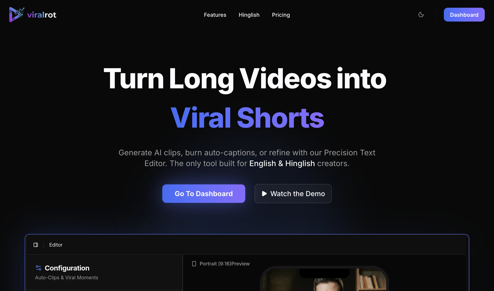
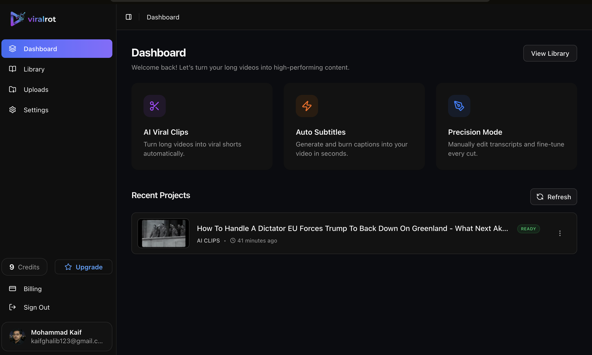
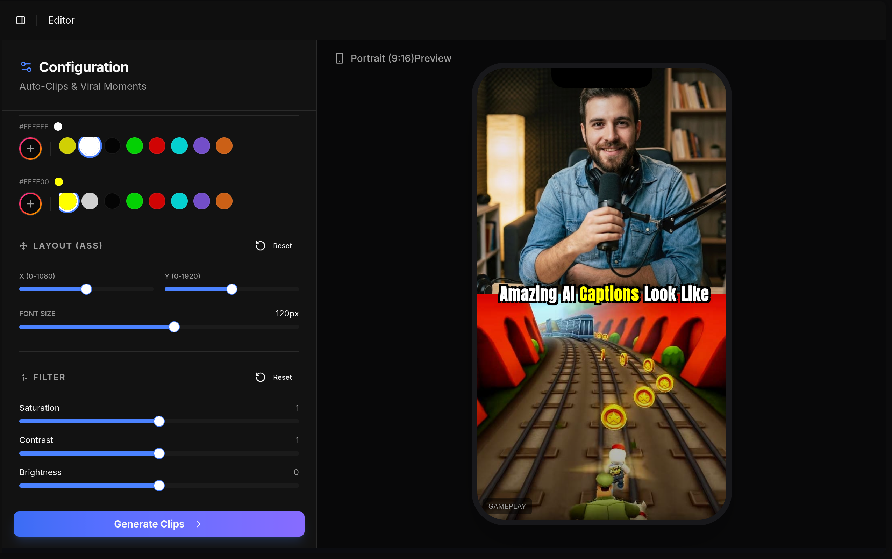

# 🎬 ViralRot — AI Video Processing Platform

> **Turn long videos into viral shorts automatically using AI.**

🌐 Website: [https://www.viralrot.lol/](https://www.viralrot.lol/)

<!-- 🎥 Demo: [https://youtu.be/zqqvq-Bwago](https://youtu.be/zqqvq-Bwago) -->

---

## 🔒 Repository Notice

⚠️ **Important:** The original production repository for ViralRot is **private**.

This public repository exists **only for portfolio & showcase purposes** to demonstrate:

- System design
- Architecture decisions
- Tech stack
- Product scope

Sensitive production code, credentials, and internal infrastructure details are **intentionally excluded**.

---

## 🧠 What is ViralRot?

**ViralRot** is a **production-grade AI video processing SaaS** that converts long-form content (podcasts, streams, informational videos, etc.) into:

- 🎯 Viral short-form clips (9:16)
- 📝 Auto-subtitled videos (including Hinglish)
- ✂️ Reviewed & burned-in subtitle videos

It is a **distributed video processing pipeline** involving:

- GPU workloads
- Background job orchestration
- LLM reasoning
- Video transcoding
- Async task queues
- Multi-stage processing pipelines

---

## 🧩 Problem This Solves

Manually:

- Watching 2-hour videos
- Finding viral moments
- Cutting clips
- Adding subtitles
- Reframing for shorts

…takes **hours per video**.

ViralRot reduces this to **one upload + automated pipeline**.

---

## ⚙️ Core Product Modes

### 1️⃣ Auto Clip Mode (AI Shorts Generator)

Pipeline:

```
Upload Video
  → Transcription (Whisper)
  → Active Speaker Detection (LR-ASD)
  → LLM (DeepSeek v3) finds viral moments
  → FFmpeg cuts clips
  → Optional gameplay compositing
  → Subtitle rendering
  → Final export
```

Capabilities:

- Upload up to **500MB**
- Handles **1–2 hour videos**
- Produces **9:16 vertical shorts**
- Optional:
  - 🎮 Game footage overlay
  - 📝 Custom positioned subtitles

---

### 2️⃣ Auto Subs Mode

- Accepts:
  - 1:1
  - 9:16
  - 16:9 (YouTube)

- Pipeline:
  - Transcription → Subtitle segmentation → Burn-in rendering

- Supports **Hinglish** with high accuracy

---

### 3️⃣ Transcribe Mode

- Whisper-based transcription
- Manual review & correction UI
- Re-render video with corrected subtitles

---

## 🖼 Product Screenshots

### 🏠 Landing Page



### 📊 Dashboard



### ✂️ Editor



---

## 🏗️ System Architecture

```text
Client (Next.js SSR)
        ↓
     tRPC API
        ↓
   Orchestration Layer
        ↓
 Inngest Background Jobs
        ↓
   FastAPI Workers
        ↓
 Modal GPU Workers
        ↓
 FFmpeg / Whisper / LLM / OpenCV
        ↓
    Final Assets
```

---

## 🧠 Why This Architecture?

### Problems:

- Video processing is **slow**
- LLM + Whisper need **GPU**
- FFmpeg is **CPU heavy**
- Tasks can take **minutes**
- Requests must **not block HTTP**

### Solutions:

- All heavy work is done via:
  - **Inngest background jobs**
  - **GPU workers on Modal**

- Frontend stays:
  - Fast
  - SSR
  - Async-poll driven

---

## 🧱 Tech Stack

### Frontend

- **Next.js** (heavy SSR)
- **tRPC** (end-to-end typesafe APIs)
- **Tailwind + shadcn/ui**
- **TanStack Query** (caching & polling)

### Backend

- **FastAPI (Python)** — video & AI orchestration
- **PostgreSQL + Prisma** — state & job tracking
- **Inngest** — durable background job execution
- **Docker** — containerized workers
- **Modal** — GPU compute

### AI & Video

- **FFmpeg** — cutting, compositing, encoding
- **OpenCV** — frame analysis
- **Whisper** — transcription
- **Whisper-Hinglish**
- **DeepSeek v3** — viral moment reasoning
- **LR-ASD** — active speaker detection

### Infra & SaaS

- **Better Auth** — Google, GitHub, Email auth
- **Polar.sh** — subscriptions & billing
- **Resend** — transactional emails

---

## 🔐 Authentication & Access Control

- Google OAuth
- GitHub OAuth
- Email + Password
- Email verification

Session & token management handled via **Better Auth**.

---

## 🧵 Background Job Design

- Every upload creates:
  - A **job record**
  - A **multi-stage pipeline**

- Stages:
  - Transcription
  - Analysis
  - Clip generation
  - Rendering

- Jobs are:
  - Restartable
  - Idempotent
  - Progress-tracked

---

## 💳 Business Model

- Paid SaaS
- Subscription billing via **Polar.sh**
- Limits enforced at:
  - Upload size
  - Processing minutes
  - Concurrent jobs

---

## 🚫 Open Source Status

- ❌ Closed source
- ❌ No self-hosting
- ❌ No public API
- ❌ No PRs accepted

This repository is a **portfolio & production codebase**.

---

## ⚠️ Development Notes

> This system depends on:

- PostgreSQL
- GPU workers
- FFmpeg
- Inngest
- Modal
- Large storage
- Multiple AI models

Local setup is **non-trivial by design**.

---

## 📦 Upload Limits

- Max upload size: **500 MB**
- Designed for:
  - 1–2 hour videos
  - Shorts
  - Square videos
  - Horizontal videos
